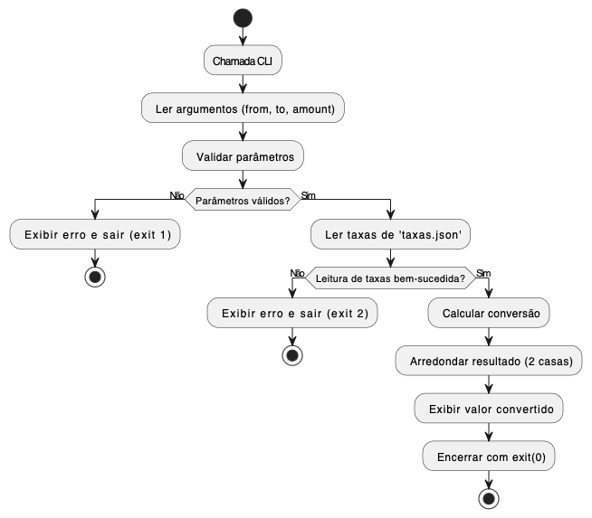

# Documentação Técnica: Conversor de Moedas CLI

## 1. Descrição da Funcionalidade

O **Conversor de Moedas CLI** é uma aplicação desenvolvida em Python que permite converter valores entre as moedas **USD**, **EUR** e **BRL** diretamente via linha de comando. A aplicação:

- Recebe parâmetros via CLI (`--from`, `--to`, `--amount`).
- Lê taxas de câmbio de um arquivo JSON local (`taxas.json`).
- Valida entradas e realiza o arredondamento a duas casas decimais utilizando a regra **ROUND_HALF_UP**.

## 2. Diagrama de Fluxo



- O diagrama ilustra o fluxo de execução da aplicação, desde a leitura dos parâmetros até a conversão e exibição do resultado.

## 3. Estrutura do Repositório

```
agile-docs-code-sprint/
├── converter.py
├── taxas.json
├── Dockerfile
├── requirements.txt
├── tests/
│   └── test_converter.py
└── docs/
    └── conversor_moedas.md
```

## 4. Interfaces Necessárias

### 4.1 Linha de Comando

```bash
python converter.py --from USD --to BRL --amount 10.50
```

| Flag       | Descrição                                       | Exemplo      |
| ---------- | ----------------------------------------------- | ------------ |
| `--from`   | Moeda de origem (USD/EUR/BRL)                   | `--from USD` |
| `--to`     | Moeda de destino (USD/EUR/BRL)                  | `--to BRL`   |
| `--amount` | Valor numérico ≥ 0, com até duas casas decimais | `--amount 5` |

### 4.2 Saídas

- **Sucesso (exit 0):** Exibe apenas o valor convertido.
- **Erro de parâmetros (exit 1):** Exibe erro de moeda ou valor inválido.
- **Erro na leitura de taxas (exit 2):** Exibe erro de arquivo ausente ou corrompido.
- **Erro inesperado (exit 3):** Exibe mensagem de exceção genérica.

## 5. Banco de Dados / Armazenamento

Arquivo local `taxas.json` contendo as taxas de conversão entre USD, EUR e BRL:

```json
{
  "USD": { "EUR": 0.92, "BRL": 5.2 },
  "EUR": { "USD": 1.09, "BRL": 5.65 },
  "BRL": { "USD": 0.19, "EUR": 0.18 }
}
```

- O arquivo deve estar no mesmo diretório que o script principal.
- O formato deve ser JSON válido.
- O arquivo deve conter as taxas de câmbio entre as moedas suportadas.

## 6. APIs ou Serviços Externos

Atualmente, a aplicação não utiliza APIs externas. Para futura expansão, recomenda-se substituir a leitura local por integração com um endpoint de taxas de câmbio.

## 7. Testes Unitários

Os testes automatizados estão localizados em `tests/test_converter.py` e abrangem:

- Conversões válidas.
- Validação de moedas inválidas.
- Validação de valores inválidos.
- Leitura incorreta de `taxas.json`.

Execução dos testes:

```bash
python tests/test_converter.py
```

## 8. Docker

A aplicação pode ser executada em um container Docker. O `Dockerfile` inclui as dependências necessárias e o script principal.

### 8.1 Build

Para construir a imagem Docker, execute:

```bash
docker build -t conversor-cli .
```

### 8.2 Execução

Para executar a aplicação em um container Docker, utilize:

```bash
docker run -it --rm conversor-cli
# Dentro do container
python converter.py --from USD --to BRL --amount 10.50
```

## 9. Considerações Finais

Essa aplicação foi desenvolvida para a disciplina **Alta Qualidade de Software** e tem como objetivo demonstrar o uso de testes automatizados.

```

```
